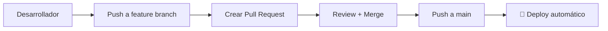

# CI/CD Pipeline para Sleepr - Microservicios con GitHub Actions

## 📋 Resumen del Pipeline

Este proyecto utiliza **GitHub Actions** para automatizar el build y deploy de 4 microservicios a **Google Cloud Artifact Registry**.

### 🏗️ Arquitectura de Microservicios

```
sleepr/
├── apps/
│   ├── reservation/    # Servicio de reservas
│   ├── auth/          # Servicio de autenticación  
│   ├── notification/  # Servicio de notificaciones
│   └── payment/       # Servicio de pagos
└── .github/workflows/
    └── deploy.yml     # Pipeline CI/CD
```

## 🚀 Workflow de GitHub Actions

### Archivo: `.github/workflows/deploy.yml`

#### **Triggers (Cuándo se ejecuta):**
```yaml
on:
  push:
    branches: [ main ]    # Deploy automático a producción
  pull_request:           # Validación en PRs (opcional)
    branches: [ main ]
```

#### **Matrix Strategy - Build Paralelo:**
```yaml
strategy:
  matrix:
    service: [reservation, auth, notification, payment]
```
- ✅ **4 jobs ejecutándose simultáneamente**
- ✅ **Builds independientes por servicio**
- ✅ **Tiempo total reducido**

#### **Variables de Entorno:**
```yaml
env:
  PROJECT_ID: sleepr-463202
  GAR_LOCATION: us-east4
  REGISTRY: us-east4-docker.pkg.dev
```

## 🔐 Autenticación con Google Cloud

### Método Actual: Service Account Keys

```yaml
- name: Authenticate to Google Cloud
  uses: google-github-actions/auth@v2
  with:
    credentials_json: ${{ secrets.GCP_SA_KEY }}
```

**Configuración requerida:**
1. **Service Account** en GCP con permisos `roles/artifactregistry.writer`
2. **Secret en GitHub** llamado `GCP_SA_KEY` con el JSON del Service Account

### Método Alternativo: Workload Identity Federation (WIF)

```yaml
- name: Authenticate to Google Cloud
  uses: google-github-actions/auth@v2
  with:
    project_id: ${{ env.PROJECT_ID }}
    service_account: ${{ env.SERVICE_ACCOUNT }}
    workload_identity_provider: ${{ env.WORKLOAD_IDENTITY_PROVIDER }}
```

#### Comparación de Métodos:

| Aspecto | Service Account Keys | Workload Identity Federation |
|---------|---------------------|------------------------------|
| **Seguridad** | ⚠️ Claves de larga duración | ✅ Tokens temporales |
| **Configuración** | ✅ Simple | ⚠️ Compleja |
| **Rotación** | ❌ Manual | ✅ Automática |
| **Best Practice** | ❌ Desaconsejado en producción | ✅ Recomendado por Google |
| **Tiempo de Setup** | ⚡ 5 minutos | 🕐 30-45 minutos |

## 📦 Pipeline Steps Detallado

### **1. Checkout Code**
```yaml
- name: Checkout code
  uses: actions/checkout@v4
```
- Descarga el código del repositorio

### **2. Docker Buildx Setup**
```yaml
- name: Set up Docker Buildx
  uses: docker/setup-buildx-action@v3
```
- Configura builder avanzado de Docker
- Habilita cache y optimizaciones

### **3. GCP Authentication**
```yaml
- name: Authenticate to Google Cloud
  uses: google-github-actions/auth@v2
  with:
    credentials_json: ${{ secrets.GCP_SA_KEY }}
```
- Autentica con Google Cloud usando Service Account

### **4. Cloud SDK Setup**
```yaml
- name: Set up Cloud SDK
  uses: google-github-actions/setup-gcloud@v2
```
- Instala y configura herramientas `gcloud`

### **5. Docker Registry Auth**
```yaml
- name: Configure Docker to use gcloud as credential helper
  run: |
    gcloud auth configure-docker ${{ env.REGISTRY }}
```
- Permite a Docker usar credenciales de Google Cloud

### **6. Build Docker Images**
```yaml
- name: Build Docker image
  run: |
    docker build \
      -t ${{ env.REGISTRY }}/${{ env.PROJECT_ID }}/${{ matrix.service }}/production \
      -f apps/${{ matrix.service }}/Dockerfile \
      .
```

**Ejemplo de imagen generada:**
```
us-east4-docker.pkg.dev/sleepr-463202/reservation/production
us-east4-docker.pkg.dev/sleepr-463202/auth/production
us-east4-docker.pkg.dev/sleepr-463202/notification/production
us-east4-docker.pkg.dev/sleepr-463202/payment/production
```

### **7. Push to Artifact Registry**
```yaml
- name: Push Docker image
  if: github.event_name == 'push'
  run: |
    docker push ${{ env.REGISTRY }}/${{ env.PROJECT_ID }}/${{ matrix.service }}/production
```
- ✅ Solo se ejecuta en **push a main**
- ❌ **NO** se ejecuta en Pull Requests

### **8. Verification**
```yaml
- name: Verify deployment
  if: github.event_name == 'push'
  run: |
    echo "Successfully deployed ${{ matrix.service }} image to Artifact Registry"
    gcloud artifacts docker images list ${{ env.REGISTRY }}/${{ env.PROJECT_ID }}/${{ matrix.service }} --limit=1
```

## 🔄 Flujo de Trabajo

### **Desarrollo Normal:**


### **Ejecución del Pipeline:**

#### **En Pull Request:**
```
┌─ reservation ✅ build only (validation)
├─ auth        ✅ build only (validation)  
├─ notification✅ build only (validation)
└─ payment     ✅ build only (validation)
```

#### **En Push a Main:**
```
┌─ reservation ✅ build → ✅ push → ✅ verify
├─ auth        ✅ build → ✅ push → ✅ verify  
├─ notification✅ build → ✅ push → ✅ verify
└─ payment     ✅ build → ✅ push → ✅ verify
```

## ⚙️ Configuración Inicial

### **1. Configurar Service Account en GCP:**

```bash
# 1. Crear Service Account
gcloud iam service-accounts create github-actions-sa \
    --description="Service Account for GitHub Actions CI/CD" \
    --display-name="GitHub Actions SA"

# 2. Obtener email del Service Account
export SA_EMAIL=$(gcloud iam service-accounts list \
    --filter="displayName:GitHub Actions SA" \
    --format="value(email)")

# 3. Asignar permisos mínimos necesarios
gcloud projects add-iam-policy-binding $PROJECT_ID \
    --member="serviceAccount:$SA_EMAIL" \
    --role="roles/artifactregistry.writer"

# 4. Crear y descargar clave JSON
gcloud iam service-accounts keys create github-sa-key.json \
    --iam-account=$SA_EMAIL
```

### **2. Configurar Secret en GitHub:**

1. Ve a tu repositorio en GitHub
2. **Settings** → **Secrets and variables** → **Actions**
3. **New repository secret**:
   - **Name**: `GCP_SA_KEY`
   - **Value**: Contenido completo del archivo `github-sa-key.json`

### **3. Verificar Artifact Registry:**

```bash
# Listar repositorios existentes
gcloud artifacts repositories list

# Crear repositorios si no existen
for service in reservation auth notification payment; do
  gcloud artifacts repositories create $service \
    --repository-format=docker \
    --location=us-east4 \
    --description="Docker repository for $service service"
done
```

## 🎯 Ventajas del Pipeline Actual

### **✅ Eficiencia:**
- **Build paralelo**: 4 servicios simultáneamente
- **Condicionales inteligentes**: Push vs PR behavior
- **Cache de Docker**: Reutilización de capas

### **✅ Seguridad:**
- **Permisos mínimos**: Service Account solo para Artifact Registry
- **Secrets management**: Credenciales protegidas en GitHub
- **Validación en PRs**: Sin deploy accidental

### **✅ Mantenibilidad:**
- **Matrix strategy**: Un workflow para todos los servicios
- **Configuración centralizada**: Variables de entorno
- **Comentarios extensivos**: Código autodocumentado

## 🚧 Mejoras Futuras

### **1. Migración a Workload Identity Federation**
- Eliminar dependencia de claves JSON
- Mejorar seguridad con tokens temporales
- Rotación automática de credenciales

### **2. Optimizaciones de Performance**
- Docker layer caching
- Builds condicionales (solo servicios modificados)
- Paralelización de pruebas

### **3. Monitoreo y Observabilidad**
- Notificaciones de Slack/Discord
- Métricas de tiempo de build
- Alertas de fallos

## 📊 Métricas Típicas

| Métrica | Valor Estimado |
|---------|----------------|
| **Tiempo total** | 8-12 minutos |
| **Tiempo por servicio** | 2-3 minutos |
| **Paralelización** | 4x más rápido |
| **Costo GitHub Actions** | ~$0 (plan gratuito) |
| **Costo Artifact Registry** | ~$0.10/GB/mes |

## 🔗 Referencias

- [GitHub Actions Documentation](https://docs.github.com/en/actions)
- [Google Cloud Artifact Registry](https://cloud.google.com/artifact-registry/docs)
- [Docker Multi-stage Builds](https://docs.docker.com/develop/dev-best-practices/dockerfile_best-practices/)
- [Workload Identity Federation Guide](./tutorial-gha-artifact-registry-es.md)

---

**Última actualización:** Julio 2025  
**Estado:** ✅ Funcional en producción
